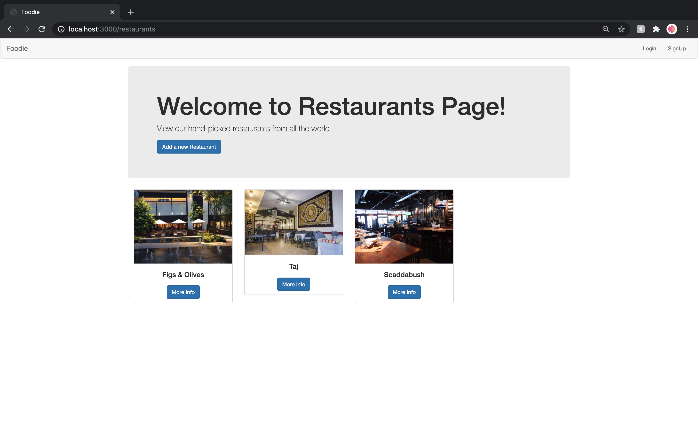
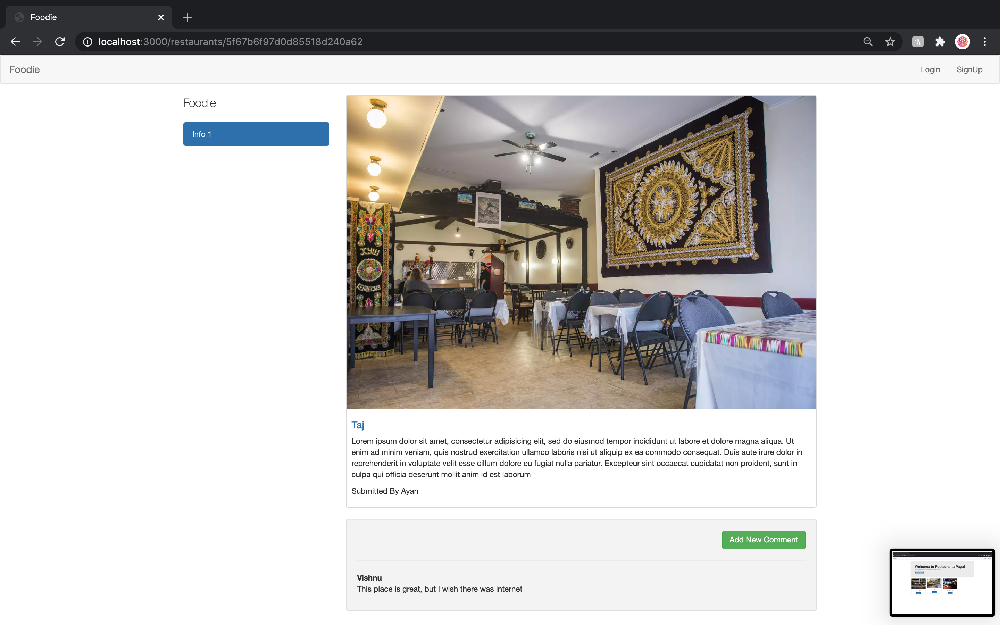

# Foodie 🍴
Foodie is a website where users can create and review restaurants.

This project was created using Node.js, Express, MongoDB, EJS and Bootstrap.

  


## Key Features:

- User login and sign up with username and password using Passport.js

- User Authorization for Create, edit and delete posts

- Restaurants: CRUD (Create, Read, Update, Destroy) - Create, edit and delete posts implemented with **RESTful routing.**

- Responsive web design


## Cloning and Running the Application in local

### Install Node JS
Refer to https://nodejs.org/en/ to install nodejs


### Install dependencies and run

Clone the project onto your local machine.

Install all the npm packages. Go into the project folder and install all npm packages:

```bash
npm install
```

To run the application:

```bash
npm start
```
